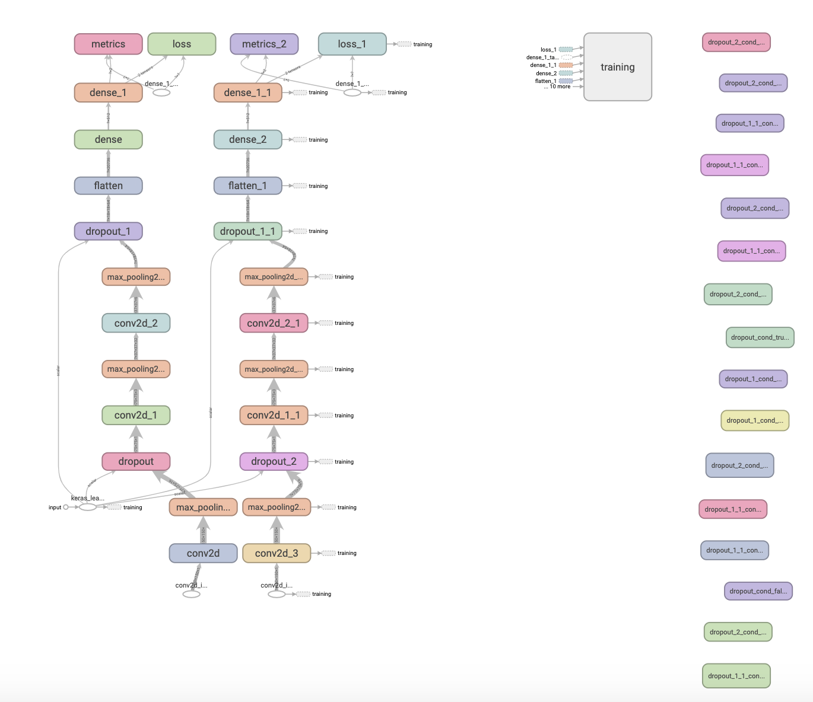

# Christopher Image Classifier
### Introduction
Christopher_Cat is one of the project; `Christopher` for familiarising with machine learning and other basic Artificial Intelligence concepts.

This repository highly depends on the tutorial provided by Tensorflow.

It is capable of the followings;
* Classify image between `cat` and `dog`
* Training the model continuously by loading previous model weights.
* Evaluate and predict any type of image that user wants to predict.

This repository is purely for educational purpose.

### Future Implementation
Data statistics visualization using `Tensorboard`

### Model Structure
Model is based on deep neural network with 2 hidden layers with Conv2D Rectified Linear Unit (ReLU),
with additional dropouts of 0.2 and maxpooling layers. Structure is referenced from official Tensorflow tutorial.

### Training & Results
Training took 10 minutes using GTX1060Ti hardware.
3 continuous traininig which includes 10 epochs per training.

`v0.0.1`: Training results show that it has an accuracy of 0.74 with value accuracy of 0.768

Dataset: 2000 training images 1000 validation images used.

Accuracy: 74%

loss: 0.48

`v0.0.2`: Input shape changed from 3 channel RGB image input to 1 channel (150x150x1) gray scale image.

Dataset: 15000 training images, 5000 validation images used.

Accuracy: 77.6%

loss: 0.4897

### Libraries Used & Setup
for virtual environment activated, execute the pip command `pip install -r requirements.txt`
> **SetupTools Issue**: Upgrade setuptools to 42.0.2 `pip install --ignore-installed --user setuptools`

1. opencv-python
1. tensorflow==2.0
1. pillow==6.2.1
1. scipy==1.4.0
1. numpy==1.17.4
1. matplotlib==3.1.2

### Reference
[Tensorflow Tutorial: Image Classification](https://www.tensorflow.org/tutorials/images/classification)

[image_classification_part1.ipynb](https://colab.research.google.com/github/google/eng-edu/blob/master/ml/pc/exercises/image_classification_part1.ipynb#scrollTo=DgmSjUST4qoS)
